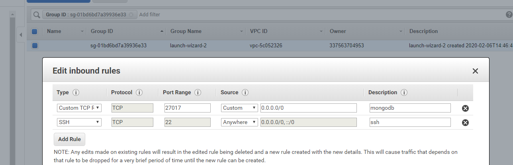
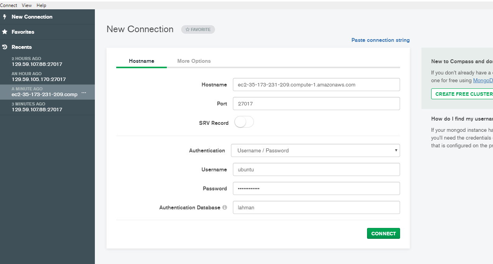
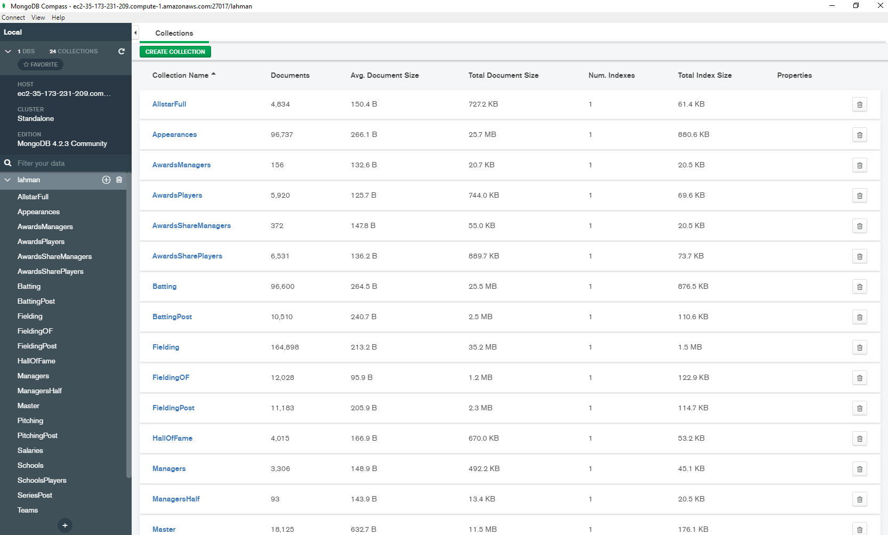
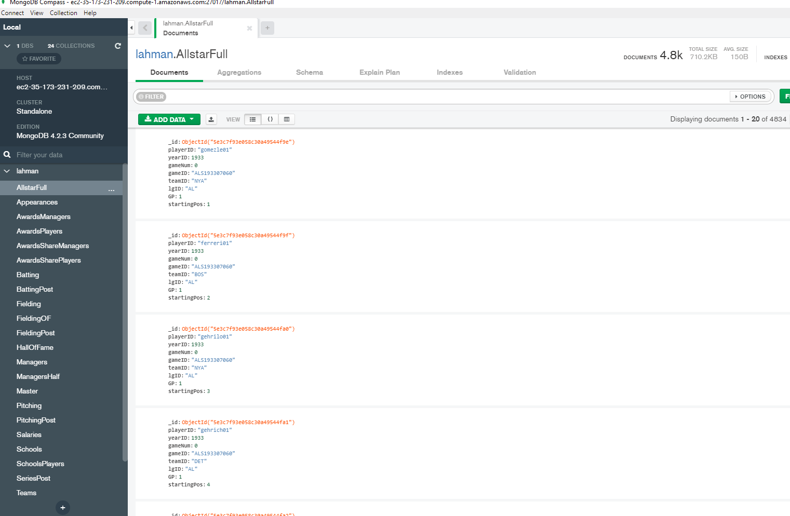

# Vanderbilt - Big Data 2020 - Homework 2

## Table of contents
- [Vanderbilt - Big Data 2020 - Homework 2](#vanderbilt---big-data-2020---homework-2)
    * [Useful Information](#useful-information)
    + [Example](#example)
    + [Mongodb Reference](#mongodb-reference)
    + [Mongodb Compass](#mongodb-compass)
    + [AWS](#aws)
    + [Github](#github)
    + [Updating the notebooks once your repository is created](#updating-the-notebooks-once-your-repository-is-created)
    + [Accepting Assignment](#accepting-assignment)
    + [Updating the python Notebook URL after accepting the assignment on classroom.github.com](#updating-the-python-notebook-url-after-accepting-the-assignment-on-classroomgithubcom)
- [Assignment](#assignment)
    + [Step-1 Create the EC2 Instance](#step-1-create-the-ec2-instance)
    + [Step-2 Install the MongoDb packages](#step-2-install-the-mongodb-packages)
    + [Step-3 Enable remote access to the mongoDB server running on EC2](#step-3-enable-remote-access-to-the-mongodb-server-running-on-ec2)
    + [Step-4 Loading the MongoDB with Lahman database](#step-4-loading-the-mongodb-with-lahman-database)
    + [Step-5 Check initial Colab Connection](#step-5-check-initial-colab-connection)
    + [Step-6 Queries - 80 points-](#step-6-queries---80-points-)
    + [Step-7 Timing Plots - 20 points](#step-7-timing-plots---20-points)
    + [Step-8 Bonus - 25 points](#step-8-bonus---25-points)

<small><i><a href='http://ecotrust-canada.github.io/markdown-toc/'>Table of contents generated with markdown-toc</a></i></small>


The goal of this homework is to learn mongodb. You will use the baseball database and do the same queries as last assignment with mongo db

The due Date: 19 February 2020: 11:59 CT

## Useful Information

### Example

Take a look at the example mondb notebook in [mongo-notebook-example](mongo-notebook-example) folder. To actually run it - you will need some credentials. It will be emailed to the class and will be valid for two weeks.

### Mongodb Reference

Take a look at the following piazza post: https://piazza.com/class/k51vgkts30b12t?cid=72
Also useful the following [slides ](https://github.com/vu-bigdata-2020/lectures/blob/master/05_nosql/NoSQLMongoDB.pdf) from lecture notes in class.


### Mongodb Compass

You can use the equivalent of SQl workbench to work with your mongodb database. It is available at https://www.mongodb.com/products/compass

### AWS
To access AWS go to https://aws.amazon.com/education/awseducate/ and use the account you created when you were invited to the class. Ensure that you can access this account and can land into an AWS console as shown below.

### Github

To push code to your repo use the git commit and push commands. But first set some settings:

	git config --global user.name "Your Name"
	git config --global user.email you@example.com

Once you modify files, use git's add, commit and push commands to push files to your repo. 

	git add file.txt
	git commit -a -m 'commit message'
	git push origin master

If you would like to use SSH keys on Github, follow the instructions at:

	https://help.github.com/articles/generating-a-new-ssh-key-and-adding-it-to-the-ssh-agent/0


### Updating the notebooks once your repository is created

Read the instructions at https://github.com/vu-bigdata-2020/lectures/blob/master/00-assignmentInstructions/AcceptingaGithubassignment.pdf


### Accepting Assignment

You will accept assignment at the github class room link

Repositories will be created for each student. You should see yours at 

    https://github.com/vu-bigdata-2020/homework-2-<GITHUB USERNAME> 

Clone the repository to your home directory on the cluster using:

    git clone https://github.com/vu-bigdata-2020/homework-2-<GITHUB USERNAME>.git

I may push updates to this homework assignment in the future. To setup an upstream repo, do the following:

    git remote add upstream https://github.com/vu-bigdata-2020/homework-2.git

To pull updates do the following:
    
    git fetch upstream
    git merge upstream/master

You will need to resolve conflicts if they occur. 

### Updating the python Notebook URL after accepting the assignment on classroom.github.com

Once you have accepted the assignment, upate all notebooks (*.ipynb) including any example I provided as discussed in in https://github.com/vu-bigdata-2020/lectures/blob/master/00-assignmentInstructions/AcceptingaGithubassignment.pdf

# Assignment 

### Step-1 Create the EC2 Instance

First install the AWS EC2 using the AWS link below (use AWS free educate account login)

Note : In Step 3 :-Configure your instance . Choose Ubuntu server instead of Amazon linux.
Note : Dont do Step 5 as it will terminate your AWS EC2 instance
https://aws.amazon.com/getting-started/tutorials/launch-a-virtual-machine/?trk=gs_card&e=gs&p=gsrc

Caution: After doing your assignment make sure to shut down the EC2 instance and logout. This is necessary to avoid unnecessary charging to your AWS account.
Follow the instructions carefully to remain within **free tier**. That last part is very important.


**Note** open the security group to allow incoming connections from anywhere on port 27017. You did this in previous assignment for MYSQL. It will work similarly here. See  this [PDF file for instructions](https://github.com/vu-bigdata-2020/lectures/blob/master/00-aws-setup-guide/Guide%20to%20use%20two%20EC2%20instances.pdf). Also see the figure below.




**Note** - you dont need to create a public elastic ip. You can use the hostname given by the connection string -- when you were connecting to the instance for accessing the instance. This will be the host string that you can give for connection -- the test connection notebook.

### Step-2 Install the MongoDb packages

Login to your EC2 then type the commands:

Import the public key used for accessing package management system
	
	$wget -qO - https://www.mongodb.org/static/pgp/server-4.2.asc | sudo apt-key add -

Create a list file for mongoDB
	
	$echo "deb [ arch=amd64 ] https://repo.mongodb.org/apt/ubuntu bionic/mongodb-org/4.2 multiverse" | sudo tee /etc/apt/sources.list.d/mongodb-org-4.2.list

	$sudo apt-get update


	$sudo apt-get install -y mongodb-org

Start the mongodb:

	$sudo service mongod start

Verify the mongod service
	
	$sudo service mongod status
	
### Step-3 Enable remote access to the mongoDB server running on EC2

Follow the instruction in the below link:

Create the remote users, but first create admin -

Enter the mongo shell on EC2

	$sudo mongo

Select admin DB

	>use admin

**Change the admin password to something else**

Create the “admin” user (you can call it whatever you want). the exit command is used to close the shell

	> db.createUser({ user: "admin", pwd: "adminpassword", roles: [{ role: "userAdminAnyDatabase", db: "admin" }] })
	> db.auth("admin", "adminpassword")
	> exit


We are now going to enable authentication on the MongoDB instance, by modifying the mongod.conf file. If you’re on Linux:

	$sudo vim  /etc/mongod.conf

**Note:** to enter edit/insert mode in vim, press 'i'. To save/exit, type ':x':

Add these lines at the bottom of the YAML config file:

```
security:
    authorization: enabled
````

This will enable authentication on your database instance. 

**Important -- external access** 

By default MongoDB instance is listening on the local loopback interface only. This means that the DBMS will be accepting connections to the databases only when they come from the host itself.

So, open mongod.conf in edit mode again, as we’re going to check out the net.bindIp option. That option tells the mongod process on which interfaces it should listen.

```
net:
    bindIp: 0.0.0.0
```

With this configuration, MongoDB will be listening on 0.0.0.0 (“all the networks”). It means that mongod will listen on all the interfaces configured on your system. Pay attention that in this way you are likely going to allow everyone on the Internet to access your database (as far as they have the credentials, of course, so pay particular attention to poor passwords).

**Restart**

Now restart the mongod service (Ubuntu syntax) for the changes to take effect.
	$sudo service mongod restart
You can check if the service is up with:
	$sudo service mongod status

To create a external user login to mongo db account such as 'ubuntu'- 
Now login to mongo shell and select admin db and authenticate

	$sudo mongo

	>use admin
	>db.auth("admin", "adminpassword")

now create lahman database in mongo

	>use  lahman;

create remote user name - 'ubuntu' and a passowrd who can use lahman db (this is generally a good idea. You restrict access for people)	 

	>db.createUser({ user: "ubuntu", pwd: "yourpassword", roles: [{ role: "dbOwner", db: "lahman" }] })

Check that everything went fine by trying to authenticate, with the db.auth(user, pwd) function.

	>db.auth("ubuntu", "yourpassword")
  
 **Note** - keep your username and password private. Very important. This is what you will use to connect to the database. 

Refer to the link if you get stuck: https://medium.com/@matteocontrini/how-to-setup-auth-in-mongodb-3-0-properly-86b60aeef7e8


### Step-4 Loading the MongoDB with Lahman database

Download the lahman database to your windows or Mac Host  from http://www.seanlahman.com/files/database/
Use the lahman_sql_2012 comma delimited version (CSV) files. 

	$mkdir rawfiles
	$cd rawfiles
	$wget http://www.seanlahman.com/files/database/lahman2012-csv.zip
	$unzip lahman2012-csv.zip

**Note** - you might be asked to install unzip - follow prompts

if everything went well - it will look like following

```
~/rawfiles$ ls 
 AllstarFull.csv      AwardsPlayers.csv         Batting.csv       FieldingOF.csv     Managers.csv       Pitching.csv       Salaries.csv         SeriesPost.csv        TeamsHalf.csv
 Appearances.csv      AwardsShareManagers.csv   BattingPost.csv   FieldingPost.csv   ManagersHalf.csv   PitchingPost.csv   Schools.csv          Teams.csv
 AwardsManagers.csv   AwardsSharePlayers.csv    Fielding.csv      HallOfFame.csv     Master.csv        'readme 2012.txt'   SchoolsPlayers.csv   TeamsFranchises.csv
```


Then import the csv files into mongoDB using the below command.
Do this for all the .csv files

	$mongoimport -d <dbname> -c <collection_name>t --type csv --file <input.csv> --headerline.

Below are the import commands for all csv files to import into the mongodb - **you need to update the username and password to what you set up -- see the instructions above**

**Using an online "find-and-replace" tool to change the "username" and "yourpassword" fields for all below queries will make this process faster.**

	$mongoimport -d lahman -c AllstarFull --type csv --file AllstarFull.csv --headerline --username "ubuntu" --password "yourpassword"
 	$mongoimport -d lahman -c AwardsSharePlayers --type csv --file AwardsSharePlayers.csv --headerline --username "ubuntu" --password "yourpassword"
 	$mongoimport -d lahman -c Appearances --type csv --file Appearances.csv --headerline --username "ubuntu" --password "yourpassword"
 	$mongoimport -d lahman -c AwardsManagers --type csv --file AwardsManagers.csv --headerline --username "ubuntu" --password "yourpassword"
 	$mongoimport -d lahman -c AwardsShareManagers --type csv --file AwardsShareManagers.csv --headerline --username "ubuntu" --password "yourpassword"
 	$mongoimport -d lahman -c AwardsPlayers --type csv --file AwardsPlayers.csv --headerline --username "ubuntu" --password "yourpassword"
 	$mongoimport -d lahman -c Batting --type csv --file Batting.csv --headerline --username "ubuntu" --password "yourpassword"
 	$ls 
 	$mongoimport -d lahman -c Fielding --type csv --file Fielding.csv --headerline --username "ubuntu" --password "yourpassword"
 	$mongoimport -d lahman -c FieldingOF --type csv --file FieldingOF.csv --headerline --username "ubuntu" --password "yourpassword"
  	$mongoimport -d lahman -c FieldingPost --type csv --file FieldingPost.csv --headerline --username "ubuntu" --password "yourpassword"
 	$mongoimport -d lahman -c HallOfFame --type csv --file HallOfFame.csv --headerline --username "ubuntu" --password "yourpassword"
  	$mongoimport -d lahman -c Managers --type csv --file Managers.csv --headerline --username "ubuntu" --password "yourpassword"
 	$mongoimport -d lahman -c ManagersHalf --type csv --file ManagersHalf.csv --headerline --username "ubuntu" --password "yourpassword"
 	$mongoimport -d lahman -c Master --type csv --file Master.csv --headerline --username "ubuntu" --password "yourpassword"
 	$mongoimport -d lahman -c Pitching --type csv --file Pitching.csv --headerline --username "ubuntu" --password "yourpassword"
  	$mongoimport -d lahman -c PitchingPost --type csv --file PitchingPost.csv --headerline --username "ubuntu" --password "yourpassword"
 	$mongoimport -d lahman -c Salaries --type csv --file Salaries.csv --headerline --username "ubuntu" --password "yourpassword"
 	$mongoimport -d lahman -c Schools --type csv --file Schools.csv --headerline --username "ubuntu" --password "yourpassword"
 	$mongoimport -d lahman -c SchoolsPlayers --type csv --file SchoolsPlayers.csv --headerline --username "ubuntu" --password "yourpassword"
  	$mongoimport -d lahman -c SeriesPost --type csv --file SeriesPost.csv --headerline --username "ubuntu" --password "yourpassword"
 	$mongoimport -d lahman -c Teams --type csv --file Teams.csv --headerline --username "ubuntu" --password "yourpassword"
 	$mongoimport -d lahman -c TeamsFranchises --type csv --file TeamsFranchises.csv --headerline --username "ubuntu" --password "yourpassword"
 	$mongoimport -d lahman -c TeamsHalf --type csv --file TeamsHalf.csv --headerline --username "ubuntu" --password "yourpassword"


**you can use a cool shell command to import all**

	$for file in `ls *.csv`; do mongoimport -d lahman -c `basename $file .csv` --type csv $file --headerline --username "ubuntu" --password "yourpassword";done


### Step-5 Check initial Colab Connection

Run the Colab connection script [test-colab-mongodb.ipynb](test-colab-mongodb.ipynb) and ensure that you get the connection and the number of tables correctly. Make sure that you update the database name, the username and the password. 

**Note** that The port should be 27017 and the host should be the hostname of your AWS instance.

**Remember** to update the python notebook as discussed in https://github.com/vu-bigdata-2020/lectures/blob/master/00-assignmentInstructions/AcceptingaGithubassignment.pdf

Remember to shutoff the EC2 instance when you are not using it.

At this point check initial connection from compass as well. During connection choose lahman as the authentication database. And provide the username and password you created for lahman database.

 If you opened the ports correctly the connection will work and you can get something like following








### Step-6 Queries - 80 points- 

Implement a function per query in a file called hw2.ipynb. Record the answers there and save it back to your repository. You have to create this file. Use the code in testcolab file.

**Remember** to update the python notebook as discussed in https://github.com/vu-bigdata-2020/lectures/blob/master/00-assignmentInstructions/AcceptingaGithubassignment.pdf


The queries are

1. The number of all stars in allstarfull.
2. The most home runs in a season by a single player (using the batting table).
3. The playerid of the player with the most home runs in a season.
4. The number of leagues in the batting table.
5. Barry Bond's average batting average (playerid = 'bondsba01') where batting average is hits / at-bats. Note you will nead to cast hits to get a decimal: cast(h as real)
6. The teamid with the fewest hits in the year 2000 (ie., yearid = '2000'). Return both the teamid, and the number of hits. Note you can use ORDER BY column and LIMIT 1.
7. The teamid in the year 2000 (i.e., yearid = '2000')  with the highest average batting average. Return the teamid and the average. To prevent divsion by 0, limit at-bats > 0.
8. The number of all stars the giants (teamid = 'SFN') had in 2000.
9. The yearid which the giants had the most all stars.
10. The average salary in year 2000.
11. The number of positions (e.g., catchers, pitchers) that have average salaries greather than 2000000 in yearid 2000. You will need to join fielding with salaries. Also consider using a HAVING clause.
12. The number of errors Barry Bonds had in 2000. 
13. The average salary of all stars in 2000.
14. The average salary of non-all stars in 2000.


### Step-7 Timing Plots - 20 points

Read about timeit function call at https://docs.python.org/2/library/timeit.html

Write a function that run all your queries 10 times and produces a box plot per query. Read about https://pandas.pydata.org/pandas-docs/stable/reference/api/pandas.DataFrame.boxplot.html

Also look at the weather box plot example in traffic example notebook in this repository


### Step-8 Bonus - 25 points 

check if you can modify your query functions and show that you can improve the time of execution by using the plots from step 7 and comparing different versions of the functions for step 6. It is required that all different versions of query functions return the correct answer. Note that you already know the correct answer from previous assignment.


